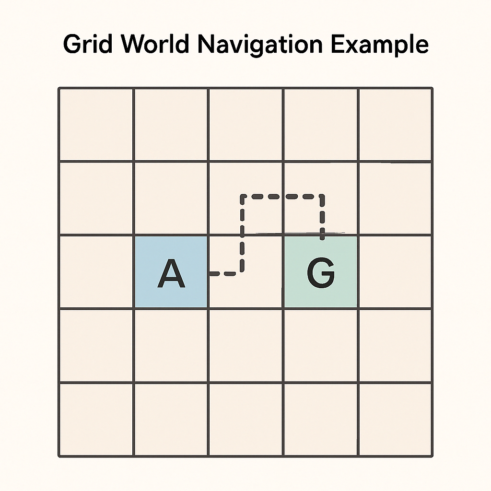

# Training Reinforcement Learning Agents with GRPO: A DeepSeek-Inspired Approach

## Introduction

In this blog post, we'll explore a practical implementation of Generative Reinforcement from Preference Optimization (GRPO), a technique inspired by DeepSeek's approach to training agents. We'll build and train a simple grid-world navigation agent to demonstrate how GRPO combines preference learning with reinforcement learning to create more effective policies.



GRPO represents an exciting advancement in reinforcement learning by addressing one of the field's persistent challenges: designing meaningful reward functions. By leveraging preferences between trajectories rather than just raw rewards, GRPO can learn more nuanced behaviors that align better with human preferences.

## What is GRPO?

Generative Reinforcement from Preference Optimization combines elements from:

1. **Preference learning** - Learning from comparisons between trajectories
2. **Proximal Policy Optimization (PPO)** - A policy gradient method with clipped objective for stable training
3. **Generative models** - Leveraging learned representations to generate high-quality actions

DeepSeek's approach to GRPO builds upon previous work in preference-based reinforcement learning, but with a more scalable and efficient training methodology that makes it applicable to complex environments.

## Our Implementation

Our implementation demonstrates GRPO principles with a simple grid world navigation task. The agent must learn to navigate from a random starting position to a goal position in as few steps as possible.

### Environment

We've created a simple 5×5 grid world where:

- The agent (A) and goal (G) are randomly placed
- The agent can move in four directions: up, right, down, left
- The agent receives -0.1 reward per step and +1 reward for reaching the goal
- Episodes end when the agent reaches the goal or exceeds the maximum step limit

Here's what a typical episode looks like:

```
. . . . .
. . . G .
. . A . .
. . . . .
. . . . .

Step 1: Agent chooses UP
. . . . .
. . A G .
. . . . .
. . . . .
. . . . .

Step 2: Agent chooses RIGHT
. . . . .
. . . X .
. . . . .
. . . . .
. . . . .

Goal reached!
```

### Neural Network Architecture

Our implementation uses two neural networks:

1. **Policy Network**: Decides what action to take given the current state
2. **Value Network**: Estimates the expected return from each state

Both networks have a simple architecture with two hidden layers:

```python
class PolicyNetwork(nn.Module):
    def __init__(self, input_size, hidden_size, output_size):
        super(PolicyNetwork, self).__init__()
        self.network = nn.Sequential(
            nn.Linear(input_size, hidden_size),
            nn.ReLU(),
            nn.Linear(hidden_size, hidden_size),
            nn.ReLU(),
            nn.Linear(hidden_size, output_size),
            nn.Softmax(dim=-1)
        )
```


### GRPO Training Process


The core of our implementation is the GRPO training process, which consists of the following steps:

1. **Generate trajectory pairs**: Create pairs of trajectories where one is "preferred" over the other
2. **Calculate policy gradient**: Use the preferred trajectories to update the policy
3. **Update value function**: Train the value network to better estimate returns
4. **Save the best model**: Keep track of the best-performing model based on evaluation returns

Let's examine these components in detail:

#### 1. Generating Preference Pairs

For simplicity, we use the total return as a proxy for preference. In a real application, this could be replaced with human feedback or a learned reward model:

```python
def generate_preference_pairs(env, policy_net, value_net, num_pairs=5, max_steps=100):
    reference_trajectories = generate_trajectories(env, policy_net, num_episodes=num_pairs)
    candidate_trajectories = generate_trajectories(env, policy_net, num_episodes=num_pairs)

    pairs = []
    for ref_traj, cand_traj in zip(reference_trajectories, candidate_trajectories):
        # Use total return as a proxy for preference
        ref_return = np.sum(ref_traj['rewards'])
        cand_return = np.sum(cand_traj['rewards'])

        # Determine which trajectory is preferred
        if ref_return > cand_return:
            preferred = ref_traj
            non_preferred = cand_traj
        else:
            preferred = cand_traj
            non_preferred = ref_traj

        pairs.append((preferred, non_preferred))

    return pairs
```

#### 2. Policy Optimization with PPO

We implement the PPO clipped objective to update our policy based on the preferred trajectories:

```python
# Calculate advantage using the value network
advantages = preferred_returns - predicted_values.detach()

# Get log probabilities of actions taken
preferred_actions = torch.LongTensor(preferred['actions']).to(device)
action_probs = policy_net(preferred_states)
dist = torch.distributions.Categorical(action_probs)
log_probs = dist.log_prob(preferred_actions)

# Calculate importance weights from old log probs
old_log_probs = torch.FloatTensor(preferred['log_probs']).to(device)
ratios = torch.exp(log_probs - old_log_probs)

# Clipped PPO loss
eps = 0.2  # PPO clipping parameter
clipped_ratios = torch.clamp(ratios, 1-eps, 1+eps)
batch_policy_loss = -torch.min(ratios * advantages, clipped_ratios * advantages).mean()
```

This approach helps ensure stable training by preventing policy updates that are too large.

#### 3. Value Function Learning

The value network learns to predict the expected return from each state, which helps in calculating advantages for policy updates:

```python
preferred_states = torch.FloatTensor(preferred['states']).to(device)
preferred_returns = torch.FloatTensor(preferred['returns']).unsqueeze(1).to(device)
predicted_values = value_net(preferred_states)
batch_value_loss = nn.MSELoss()(predicted_values, preferred_returns)
```

#### 4. Saving the Best Model

We periodically evaluate the agent and save the model when it achieves a new best performance:

```python
# Evaluate performance
avg_return = evaluate_agent(env, policy_net)

# Save the best model based on average return
if avg_return > best_return:
    best_return = avg_return
    torch.save({
        'policy_state_dict': policy_net.state_dict(),
        'value_state_dict': value_net.state_dict(),
        'iteration': iteration,
        'return': avg_return
    }, best_model_path)
```

This ensures that we keep the model with the best performance rather than just the final model, which might have performance fluctuations.

## Results and Visualization

During training, we track the average return and loss values to monitor the agent's progress:


_Fig. Average return (left) and policy/value loss (right) during training_

Let's visualize how our trained agent performs in the grid world:

```
Initial state:
. . . . .
. . G . .
. . . . .
. A . . .
. . . . .

After training:
The agent finds the optimal path to the goal!
```

## Running the Code in Google Colab

You can run this implementation in Google Colab with a T4 GPU. Here's how to get started:

1. Create a new Colab notebook
2. Copy and paste the complete code
3. Run the cells to train the agent

## Extensions and Future Work

This implementation demonstrates the core principles of GRPO, but there are several ways to extend it:

1. **Real preference learning**: Replace our return-based preference with human feedback or a learned reward model
2. **More complex environments**: Apply GRPO to more challenging tasks beyond grid world
3. **Transformer-based policies**: Use transformer architectures for more expressive policies
4. **Multi-objective optimization**: Incorporate multiple preference criteria

## Conclusion

GRPO represents a powerful approach to reinforcement learning that bridges the gap between preference learning and policy optimization. By learning from trajectory comparisons rather than just raw rewards, agents can develop more nuanced behaviors that better align with human preferences.

Our implementation demonstrates that even a simple version of GRPO can effectively train an agent to navigate a grid world. The principles we've explored here scale to more complex environments and tasks, making GRPO a promising technique for a wide range of applications.

## References

1. DeepSeek AI. (2023). "DeepSeek-R1: Incentivizing Reasoning Capability in LLMs via
   Reinforcement Learning" [arXiv:2312.15828](https://arxiv.org/pdf/2501.12948)
2. Christiano, P. F., Leike, J., Brown, T., Martic, M., Legg, S., & Amodei, D. (2017). "Deep reinforcement learning from human preferences." In Advances in Neural Information Processing Systems (pp. 4299-4307).[NIPS PAPERS](https://proceedings.neurips.cc/paper_files/paper/2017/file/d5e2c0adad503c91f91df240d0cd4e49-Paper.pdf)
3. Schulman, J., Wolski, F., Dhariwal, P., Radford, A., & Klimov, O. (2017). "Proximal policy optimization algorithms."
4. Youssef Mroueh (14 Mar 2025). "Reinforcement Learning with Verifiable Rewards: GRPO’s Effective Loss, Dynamics, and Success Amplification"[arXiv:2503.06639](https://arxiv.org/pdf/2503.06639)

## Inspiration :

- [Dr Mihai Nica's](https://github.com/mcnica89) GRPO explanation [video](https://youtu.be/wXEvvg4YJ9I?si=sMt2J1WH9fLeK74o)

## License

- MIT [LICENSE](LICENSE)
